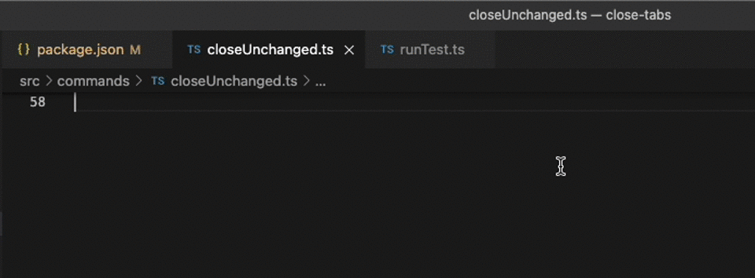

# Close Tabs - Unchanged, Diff, Left and more!

More options to close open tabs, fully configurable.



## Features

Add the following options to the tab context menu:

- Close all open tabs without changes (from the git working tree).
- Close all Diff Editors (Working Tree tabs).
- Close all tabs to the left.
- Close all tabs with the same file type or file type specified in settings.
- Fine-grained settings to toggle which buttons are shown in the tab context menu.
- Enable/disable the extension for pinned tabs via settings.

## Extension Settings

```json
"closeTabs.allowClosePinnedTabs": {
    "type": "boolean",
    "default": false,
    "description": "Allow closing pinned tabs."
},
"closeTabs.showCloseUnchanged": {
    "type": "boolean",
    "default": true,
    "description": "Show the \"Close Unchanged\" button."
},
"closeTabs.showCloseDiffEditors": {
    "type": "boolean",
    "default": true,
    "description": "Show the \"Close Diff Editors\" button."
},
"closeTabs.showCloseToTheLeft": {
    "type": "boolean",
    "default": true,
    "description": "Show the \"Close to the Left\" button."
}
"closeTabs.showCloseToTheLeft": {
    "type": "boolean",
    "default": true,
    "description": "Show the \"Close to the Left\" button."
}
"config.closeTabs.showCloseType": {
    "type": "boolean",
    "default": true,
    "description": "Show \"Close all of Type\" command in the context menu"
}
"closeTabs.extensionsToClose": [
    "pdf",
    ".png"
]
"closeTabs.extensionsCaseSensitive": false
```

Coming soon:

- Suggest/Request your feature by opening an issue!

## Release Notes

### 1.1.5

- Added "Close all of Type" command in the context menu to close all tabs with the same file extension as the selected tab.
- Added "Close default Types" command to close all open tabs specified in the new `closeTabs.extensionsToClose` setting.
- Added `closeTabs.extensionsToClose` setting to specify which file extensions to close with the new "Close default Types" command.

### 1.1.4

- Fixed "Close Unchanged" in projects with multiple repositories.

### 1.1.3

- Temporary fix for Close Left (only works from the active tab until a better solution is found.)

### 1.1.2

- Enable/disable the extension for pinned tabs via settings.

### 1.1.1

- Add empty `activationEvents` to fix a warning in the marketplace since vscode 1.77.

### 1.1.0

- Add settings to toggle which buttons are shown in the tab context menu.
- Add icon to the extension! :)

### 1.0.0

It does what the initial plan was about!

Add the following options to the tab context menu:

- Close all open tabs without changes (from the git working tree).
- Close all Diff Editors (Working Tree tabs).
- Close all tabs to the left.

### 0.0.1

Just trying to make it work, somehow.
